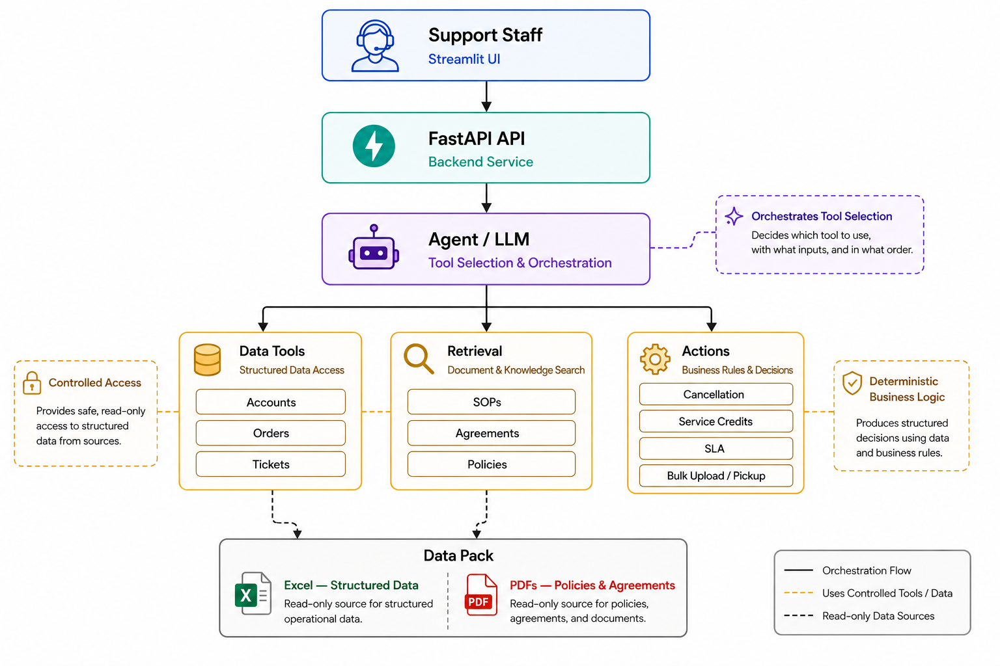

# ParcelPilot — Internal Support Operations AI Agent

An AI-powered internal support operations agent for CalQuity's ParcelPilot platform.

ParcelPilot helps support staff answer operational questions by combining an LLM with controlled data tools, document retrieval, and deterministic business-rule actions. The agent can retrieve structured account, order, and ticket information, search current SOPs and customer agreements, and evaluate operational decisions such as cancellation eligibility, service credits, SLA targets, bulk-upload limits, and pickup status.

The system is designed around **controlled tool use and read-only source data**. The LLM is responsible for understanding requests and selecting tools, while business-critical decisions are handled by deterministic application logic. State-changing requests require a human confirmation gate and are not automatically executed.

---

## Architecture



## 🎥 Demo Video

[](https://youtu.be/1KyzPVahwV0)

### Request Flow

```text
Support Staff
     |
     v
Streamlit UI
     |
     v
FastAPI API
     |
     v
Agent / LLM
     |
     +-------------------+-------------------+
     |                   |                   |
     v                   v                   v
Data Tools          Retrieval            Actions
     |                   |                   |
     |                   |                   +-- Cancellation
     |                   |                   +-- Service Credits
     |                   |                   +-- SLA
     |                   |                   +-- Bulk Upload / Pickup
     |                   |
     |                   +-- SOPs
     |                   +-- Agreements
     |                   +-- Policies
     |
     +-- Accounts
     +-- Orders
     +-- Tickets

              |
              v
           Data Pack
        Excel + PDFs
         Read-only
```

### Architectural Responsibilities

- **Streamlit UI** — provides the interface used by support staff.
- **FastAPI** — exposes the backend chat API and connects the UI with the agent.
- **Agent / LLM** — interprets requests, selects the appropriate tool, supplies tool inputs, and presents the resulting information.
- **Data Tools** — provide controlled access to structured accounts, orders, and tickets.
- **Retrieval** — searches the supplied SOPs, policies, agreements, and operational documents.
- **Actions** — apply deterministic business rules to operational questions and return structured decisions.
- **Data Pack** — contains the read-only Excel operational snapshot and PDF documentation.
- **Confirmation Gate** — state-changing proposals require explicit staff confirmation and are not automatically executed.

---

## Key Capabilities

### Structured Data Lookup

The agent can work with operational data including:

- Accounts
- Orders
- Tickets
- Order and account relationships
- Ticket status and severity

### Document Retrieval

The retrieval layer searches the provided documentation, including:

- Current support policies
- Cancellation and service-credit SOPs
- Product operations and known-issues documentation
- Enterprise customer agreements

Deprecated policy documents are filtered out so that obsolete policy information is not accidentally used when answering operational questions.

### Deterministic Business Decisions

Business-rule modules handle operational evaluations such as:

- Cancellation eligibility and applicable fees
- Failed-pickup service-credit eligibility
- First-response SLA targets
- Bulk-upload capability and row limits
- Pickup-status interpretation and known timing risks

The LLM does not independently calculate these business rules. It selects the appropriate action/tool, while the application logic produces the structured decision.

### Human Confirmation for State-Changing Requests

The system separates **decision-making** from **execution**.

For requests involving state-changing operations, the agent produces a confirmation-required proposal rather than automatically modifying operational state.

The provided data pack is a read-only snapshot, so there is no direct write-back to the Excel data or operational system.

---

## Tech Stack

| Layer | Technology |
|---|---|
| UI | Streamlit |
| Backend API | FastAPI |
| Agent / LLM | Groq using an OpenAI-compatible API |
| Language | Python |
| Structured Data | Excel |
| Knowledge Sources | PDF documents |
| Retrieval | Document retrieval layer |
| Testing | pytest |

---

## Project Structure

```text
ParcelPilot/
│
├── app/
│   ├── actions/
│   │   ├── cancellation.py
│   │   ├── models.py
│   │   ├── policy.py
│   │   ├── product.py
│   │   ├── service.py
│   │   ├── service_credit.py
│   │   └── sla.py
│   │
│   ├── agent/
│   │   ├── agent.py
│   │   ├── executor.py
│   │   ├── openai_tools.py
│   │   └── prompts.py
│   │
│   ├── api/
│   │   └── main.py
│   │
│   ├── data/
│   │   ├── models.py
│   │   └── repository.py
│   │
│   ├── retrieval/
│   │   ├── models.py
│   │   └── retriever.py
│   │
│   ├── tools/
│   │   └── tools.py
│   │
│   └── ui/
│       ├── client.py
│       └── streamlit_app.py
│
├── data/
│   ├── ParcelPilot_Assessment_Data.xlsx
│   └── documents/
│       ├── 01_Support_Policy_v3_CURRENT.pdf
│       ├── 02_Support_Policy_v2_DEPRECATED.pdf
│       ├── 03_Cancellation_and_Service_Credit_SOP_v4.pdf
│       ├── 04_Product_Operations_Guide_and_Known_Issues.pdf
│       ├── 05_Northstar_Logistics_Enterprise_Agreement.pdf
│       └── 06_LumenWorks_Service_Agreement.pdf
│
├── docs/
│   ├── architecture.png
│   └── DATA_MODEL.md
│
├── scripts/
├── tests/
├── .env.example
├── .gitignore
├── requirements.txt
└── README.md
```

---

## Setup

Run all commands from the repository root.

### 1. Create a virtual environment

#### Windows PowerShell

```powershell
python -m venv .venv
```

#### Linux / macOS

```bash
python -m venv .venv
source .venv/bin/activate
```

### 2. Activate the environment

#### Windows PowerShell

```powershell
.\.venv\Scripts\Activate.ps1
```

If PowerShell blocks script execution, you can use the virtual environment's Python directly or use Command Prompt.

#### Windows Command Prompt

```cmd
.venv\Scripts\activate.bat
```

#### Linux / macOS

```bash
source .venv/bin/activate
```

### 3. Install dependencies

```bash
pip install -r requirements.txt
```

### 4. Configure environment variables

Copy `.env.example` to `.env`.

#### Windows PowerShell

```powershell
Copy-Item .env.example .env
```

#### Linux / macOS

```bash
cp .env.example .env
```

Set the required API key:

```env
GROQ_API_KEY=your_groq_api_key_here
GROQ_MODEL=openai/gpt-oss-120b
```

`GROQ_MODEL` is optional. If omitted, the application uses the project's configured default model.

---

## Running the Application

The application uses two processes:

1. FastAPI backend
2. Streamlit frontend

Open two terminals at the repository root.

### Terminal 1 — FastAPI Backend

```bash
uvicorn app.api.main:app --reload
```

The API will run on:

```text
http://127.0.0.1:8000
```

### Terminal 2 — Streamlit UI

```bash
streamlit run app/ui/streamlit_app.py
```

Open the Streamlit URL displayed in the terminal.

The Streamlit client sends chat requests to the FastAPI `/chat` endpoint.

The backend URL can be configured through the application's configuration options.

---

## Example Queries

Once the application is running, example support questions include:

```text
Can ORD-1001 be cancelled?
```

```text
Is ORD-1002 eligible for a service credit?
```

```text
What is the first-response SLA for a P1 ticket for ACCT-001?
```

```text
Does ACCT-002 have Bulk Upload, and what is the maximum CSV row limit?
```

```text
What is the pickup status of ORD-1002?
```

The agent determines which tool or combination of tools is required, retrieves the relevant data or documents, and returns a grounded response with the applicable reasoning and sources.

---

## Tooling and Agent Flow

The agent uses explicit tools rather than allowing the language model to directly access the underlying data sources.

The general flow is:

```text
User Request
     |
     v
Agent / LLM
     |
     v
Tool Selection
     |
     +----------------------+----------------------+
     |                      |                      |
     v                      v                      v
Structured Lookup       Document Search       Action Evaluation
     |                      |                      |
     v                      v                      v
Accounts / Orders       SOPs / Policies       Business Rules
Tickets                 Agreements             Structured Decision
     |                      |                      |
     +----------------------+----------------------+
                            |
                            v
                       Final Response
```

This separation allows the LLM to focus on request understanding and orchestration while application code handles deterministic business logic.

---

## Safety and Control Model

ParcelPilot intentionally separates **LLM orchestration** from **business logic**.

```text
User Request
     |
     v
LLM interprets request
     |
     v
Selects controlled tool
     |
     +--------------------+
     |                    |
     v                    v
Structured Data       Document Retrieval
     |                    |
     +---------+----------+
               |
               v
      Deterministic Action
               |
               v
       Structured Decision
               |
               v
       Human Confirmation
       when required
```

This prevents the language model from directly modifying operational data or independently implementing critical business rules.

The provided Excel workbook and PDF documents are treated as **read-only sources of truth**.

---

## Policy and Knowledge Handling

The retrieval layer works with the supplied operational documentation and prioritizes current policy information.

The project includes both current and deprecated policy material. Deprecated support-policy documents are explicitly filtered from retrieval results so that obsolete rules are not accidentally used when answering operational questions.

Customer-specific agreements can also be retrieved when determining account-specific terms.

The system can therefore combine:

```text
Current SOP / Policy
        +
Customer Agreement
        +
Operational Data
        |
        v
Grounded Operational Decision
```

---

## Confirmation and State Changes

ParcelPilot distinguishes between evaluating an operation and actually executing it.

For example, a cancellation request can be evaluated to determine:

- Whether the shipment is eligible for cancellation
- Whether a cancellation fee applies
- Why the decision was reached

However, the evaluation itself does not cancel the shipment.

For state-changing requests, the system creates a confirmation-required proposal. The support staff member can explicitly confirm or cancel the proposal through the UI.

The current assignment data pack does not provide a writable operational system, so the project does not directly mutate the underlying Excel snapshot.

---

## Testing

The repository contains automated tests covering the major application layers, including:

- Agent behavior
- API behavior
- Data repository access
- Retrieval
- Tool wrappers
- Business actions
- UI behavior

Run the complete test suite with:

```bash
python -m pytest -q
```

---

## Design Principles

### Grounded Answers

Responses are based on the supplied operational data and documentation rather than relying only on general model knowledge.

### Controlled Tool Access

The agent interacts with data through explicit application tools instead of directly accessing files or implementing arbitrary operations.

### Deterministic Business Logic

Critical operational rules are implemented in Python action modules rather than being left entirely to the LLM.

### Read-Only Source Data

The provided Excel and PDF data pack is treated as a read-only source.

### Human-in-the-Loop

Potentially state-changing operations require explicit confirmation rather than being automatically executed.

### Separation of Concerns

The application separates:

- UI
- API
- Agent orchestration
- Tool access
- Retrieval
- Business actions
- Data access

This makes the individual components easier to test, reason about, and extend.

---

## Demo Flow

A recommended demonstration of the project is:

1. Start the FastAPI backend.
2. Start the Streamlit application.
3. Demonstrate a structured-data lookup.
4. Demonstrate a policy/document retrieval question.
5. Demonstrate a deterministic business-rule evaluation.
6. Demonstrate an account-specific SLA or agreement lookup.
7. Demonstrate a state-changing request and show the confirmation gate.
8. Explain how the LLM selects tools while deterministic application code performs business-rule evaluation.

---

## Project Goal

ParcelPilot demonstrates how an internal support agent can combine an LLM with structured tools, document retrieval, deterministic business logic, and human confirmation to provide reliable operational assistance without giving the language model unrestricted access to business systems.
