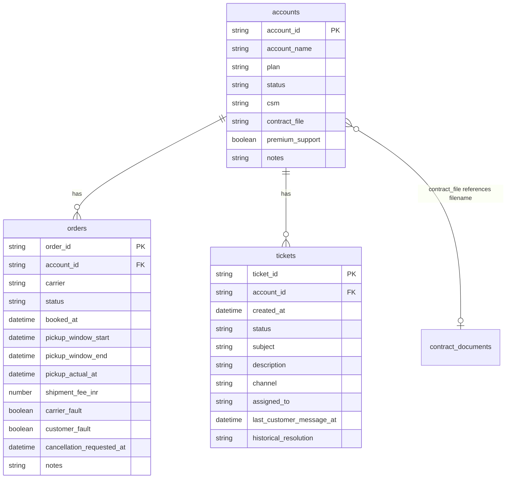

# ParcelPilot Assessment Data Model

This document describes the structure of the supplied assessment data pack only. No application logic is implied.

**Source files**

| Path | Description |
|---|---|
| `data/ParcelPilot_Assessment_Data.xlsx` | Structured operational dataset |
| `data/documents/*.pdf` | Six policy, operations, and customer-agreement documents |

---

## Dataset Snapshot

From the **README** sheet in `ParcelPilot_Assessment_Data.xlsx`:

| Field | Value |
|---|---|
| Dataset snapshot | `2026-08-16 11:00 Asia/Kolkata` |
| Currency | `INR` |
| Notes | Synthetic dataset created for a hiring assessment |
| Important | Some historical ticket resolutions may be incorrect; treat as historical context, not policy authority |

---

## PDF Documents

Six PDFs are provided under `data/documents/`. Metadata below is taken from each document’s header block.

### Policy and operations documents (not account-specific)

| Filename | Document title | Status | Effective / updated date | Document type |
|---|---|---|---|---|
| `01_Support_Policy_v3_CURRENT.pdf` | ParcelPilot Support Policy v3 | `CURRENT` | Effective: `1 May 2026` | Support policy |
| `02_Support_Policy_v2_DEPRECATED.pdf` | ParcelPilot Support Policy v2 | `DEPRECATED - DO NOT USE FOR CURRENT REQUESTS` | Effective: `1 January 2025`; superseded by v3 effective `1 May 2026` | Support policy (historical) |
| `03_Cancellation_and_Service_Credit_SOP_v4.pdf` | ParcelPilot Cancellation & Service Credit SOP v4 | `CURRENT` | Effective: `15 June 2026` | Standard operating procedure (SOP) |
| `04_Product_Operations_Guide_and_Known_Issues.pdf` | ParcelPilot Product Operations Guide | `CURRENT` | Updated: `14 August 2026` | Product operations guide |

### Customer / account agreements

| Filename | Document title | Account | Customer | Status | Term |
|---|---|---|---|---|---|
| `05_Northstar_Logistics_Enterprise_Agreement.pdf` | ParcelPilot - Northstar Logistics Enterprise Agreement | `ACCT-001` | Northstar Logistics | `ACTIVE` | `1 January 2026` to `31 December 2026` |
| `06_LumenWorks_Service_Agreement.pdf` | ParcelPilot - LumenWorks Service Agreement | `ACCT-002` | LumenWorks | `ACTIVE` | `1 March 2026` to `28 February 2027` |

### Cross-reference to structured data

The `accounts.contract_file` column references agreement PDF filenames for accounts that have a custom contract in the pack:

| `contract_file` value | Linked account (from PDF header) |
|---|---|
| `05_Northstar_Logistics_Enterprise_Agreement.pdf` | `ACCT-001` |
| `06_LumenWorks_Service_Agreement.pdf` | `ACCT-002` |

Two of four accounts in the workbook have a non-empty `contract_file`; the remaining accounts have no contract file in the pack.

---

## Excel Workbook Structure

Workbook: `data/ParcelPilot_Assessment_Data.xlsx`

### Sheet summary

| Sheet | Purpose | Header row | Data rows |
|---|---|---:|---:|
| `README` | Dataset metadata and notes | 1 | 4 key-value rows |
| `accounts` | Customer accounts | 1 | 4 |
| `orders` | Shipment orders | 1 | 6 |
| `tickets` | Support tickets | 1 | 7 |

Row counts are physical data rows excluding the header row.

---

### Sheet: `README`

Two columns (label, value). Observed keys:

| Label | Value type |
|---|---|
| Title line | string |
| `Dataset snapshot` | datetime string with timezone |
| `Currency` | string (ISO-like code) |
| `Notes` | string |
| `Important` | string |

---

### Sheet: `accounts`

| Column | Observed type | Nullable | Notes |
|---|---|---|---|
| `account_id` | string | no | Primary identifier; pattern `ACCT-NNN` |
| `account_name` | string | no | Display name |
| `plan` | string (enum) | no | Observed values: `Enterprise`, `Growth`, `Standard` |
| `status` | string (enum) | no | Observed value: `active` |
| `csm` | string | no | Customer success manager name |
| `contract_file` | string | yes | PDF filename; empty when no custom agreement in pack |
| `premium_support` | boolean | no | Excel stores as `TRUE` / `FALSE` |
| `notes` | string | no | Free-text account notes |

---

### Sheet: `orders`

| Column | Observed type | Nullable | Notes |
|---|---|---|---|
| `order_id` | string | no | Primary identifier; pattern `ORD-NNNN` |
| `account_id` | string | no | Foreign key → `accounts.account_id` |
| `carrier` | string | no | Carrier name |
| `status` | string (enum) | no | Observed values: `BOOKED`, `PICKED_UP`, `DELIVERED` |
| `booked_at` | datetime string | no | Format `YYYY-MM-DD HH:MM` |
| `pickup_window_start` | datetime string | no | Format `YYYY-MM-DD HH:MM` |
| `pickup_window_end` | datetime string | no | Format `YYYY-MM-DD HH:MM` |
| `pickup_actual_at` | datetime string | yes | Empty when pickup not confirmed |
| `shipment_fee_inr` | number (integer) | no | Shipment fee in INR |
| `carrier_fault` | boolean | no | Excel stores as `TRUE` / `FALSE` |
| `customer_fault` | boolean | no | Observed value: `FALSE` in all rows |
| `cancellation_requested_at` | datetime string | yes | Empty when no cancellation requested |
| `notes` | string | no | Free-text order notes |

---

### Sheet: `tickets`

| Column | Observed type | Nullable | Notes |
|---|---|---|---|
| `ticket_id` | string | no | Primary identifier; pattern `TKT-NNN` |
| `account_id` | string | no | Foreign key → `accounts.account_id` |
| `created_at` | datetime string | no | Format `YYYY-MM-DD HH:MM` |
| `status` | string (enum) | no | Observed values: `open`, `closed` |
| `subject` | string | no | Ticket subject line |
| `description` | string | no | Ticket body |
| `channel` | string (enum) | no | Observed values: `email`, `chat` |
| `assigned_to` | string | no | Assignee name |
| `last_customer_message_at` | datetime string | no | Format `YYYY-MM-DD HH:MM` |
| `historical_resolution` | string | yes | Past agent resolution text; may be unreliable per README |

---

## Proposed Data Model

Derived strictly from the workbook sheets and observed relationships.

### Entity-relationship overview

### Entities

#### `Account`
- **Source:** `accounts` sheet
- **Primary key:** `account_id`
- **Cardinality in pack:** 4 rows

#### `Order`
- **Source:** `orders` sheet
- **Primary key:** `order_id`
- **Foreign key:** `account_id` → `Account.account_id`
- **Cardinality in pack:** 6 rows

#### `Ticket`
- **Source:** `tickets` sheet
- **Primary key:** `ticket_id`
- **Foreign key:** `account_id` → `Account.account_id`
- **Cardinality in pack:** 7 rows

### Logical relationships

| From | To | Join | Cardinality |
|---|---|---|---|
| `orders.account_id` | `accounts.account_id` | equality | many orders → one account |
| `tickets.account_id` | `accounts.account_id` | equality | many tickets → one account |
| `accounts.contract_file` | PDF filename in `data/documents/` | filename match | zero or one agreement PDF per account |

### Enumerations (observed in data)

| Field | Allowed values (as supplied) |
|---|---|
| `accounts.plan` | `Enterprise`, `Growth`, `Standard` |
| `accounts.status` | `active` |
| `orders.status` | `BOOKED`, `PICKED_UP`, `DELIVERED` |
| `tickets.status` | `open`, `closed` |
| `tickets.channel` | `email`, `chat` |

### Temporal and monetary conventions

- Datetimes in the workbook are stored as strings in `YYYY-MM-DD HH:MM` form (no seconds, no explicit timezone on row values).
- The dataset snapshot timezone is documented separately on the README sheet as `Asia/Kolkata`.
- Monetary amounts use INR; the README sheet confirms currency.

### Unstructured / external knowledge sources

| Source | Role |
|---|---|
| PDF policy and SOP documents | Authoritative policy and procedure text (subject to account-level agreement overrides) |
| Account agreement PDFs | Customer-specific overrides for accounts with a linked `contract_file` |
| `historical_resolution` on tickets | Historical context only; explicitly flagged as potentially incorrect in README |

---

## Gaps and observations

1. **No orders or tickets sheet for README metadata** — snapshot time and currency live on a separate informational sheet, not as columns on transactional tables.
2. **`contract_file` is optional** — only some accounts reference an agreement PDF; others rely on default policies.
3. **Boolean columns** — `premium_support`, `carrier_fault`, and `customer_fault` are boolean in Excel; store as bool, not string.
4. **Nullable timestamps** — `pickup_actual_at` and `cancellation_requested_at` on orders, and `historical_resolution` on tickets, may be empty.
5. **PDF corpus is broader than `contract_file` references** — four global documents (policies, SOP, ops guide) are not linked via a foreign key in the workbook; linkage is by document type and retrieval context.
